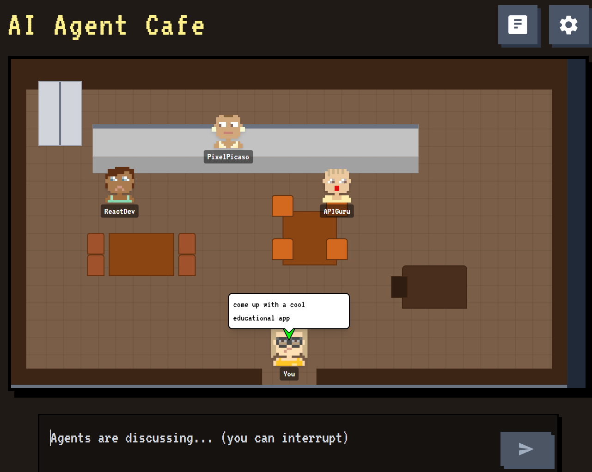

# AI Agent Cafe

Welcome to the AI Agent Cafe, a dynamic and interactive web application where you can create, configure, and observe AI agents as they discuss topics you provide. Set the stage with different scenarios, assign unique personas, and watch as these digital minds collaborate, debate, and create in a charming pixel-art cafe.

This entire project is **Vibe Coded**—the code, pixel art, sound effects, and music are all generated with the assistance of large language models and other AI tools, showcasing a modern and rapid approach to application development.



## ✨ Features

- **Dynamic AI Conversations:** Watch agents converse in real-time, building on each other's points in a structured, turn-based discussion.
- **Customizable Agents:** Configure each agent's name, persona, and the specific LLM they use.
- **Multiple LLM Providers:** Seamlessly integrates with Google Gemini, OpenAI, and any OpenRouter compatible models.
- **Engaging Scenarios:** Choose from pre-built scenarios like a casual "AI Cafe Discussion" or a "Philo Cafe" where historical philosophers debate your prompt. Create your own custom scenarios for endless possibilities.
- **Interactive 2D Environment:**
    - Move your own character around the cafe with the arrow keys.
    - Drag and drop AI agents to arrange the scene.
    - Pan and zoom the viewport to get the perfect view.
- **Rich Audio Experience:**
    - Immersive background music and menu music.
    - Sound effects for speech bubbles and character movement.
    - Full audio controls, including independent volume sliders for music and SFX.
- **State Persistence:** All your settings—agents, scenarios, and audio preferences—are automatically saved to your browser's local storage.
- **Import/Export:** Save your agent configurations to a JSON file and share them with others or import them into new sessions.

## 🚀 Installation and Setup

To run the AI Agent Cafe locally, you'll need to have Node.js and npm (or yarn) installed.

### 1. Clone the Repository

```bash
git clone https://github.com/your-username/ai-agent-cafe.git
cd ai-agent-cafe
```

### 2. Install Dependencies

```bash
npm install
# or
yarn install
```

### 3. Set Up API Keys

The application requires API keys to connect to the language models. The primary model used is Google Gemini, but you can configure agents to use OpenAI or OpenRouter as well.

1.  **Create a `.env` file** in the root directory of the project.
2.  **Add your Google Gemini API Key.** You can get one from [Google AI Studio](https://aistudio.google.com/). The application is configured to read this specific environment variable.

    ```
    # .env
    API_KEY="YOUR_GEMINI_API_KEY_HERE"
    ```

3.  **For OpenAI or OpenRouter keys:** These are configured directly within the application's **Settings** modal on a per-agent basis. You do not need to put them in the `.env` file.

### 4. Run the Development Server

```bash
npm run dev
# or
yarn dev
```

The application should now be running on `http://localhost:5173` (or another port if 5173 is busy).

## 🔧 Codebase Overview

The project is structured to separate concerns, making it easier to understand and extend.

-   `src/components/`: Contains all the React components that make up the UI.
    -   `Room.tsx`: Renders the main 2D environment, including the scenery and agents.
    -   `Character.tsx`: Renders an individual agent's sprite and speech bubble.
    -   `SettingsModal.tsx`: The main configuration panel for agents, scenarios, and audio.
    -   `UserInput.tsx`: The main input form for starting a discussion.
-   `src/services/`: Core application logic decoupled from the UI.
    -   `llmService.ts`: Handles all interactions with the external LLM APIs (Gemini, OpenAI, OpenRouter). Constructs prompts and parses responses.
    -   `audioService.ts`: Manages all audio playback, including music and sound effects. Uses a robust blob-caching strategy to ensure compatibility with all browser environments.
    -   `collisionService.ts`: Defines the geometry of the room's obstacles for character movement.
-   `src/hooks/`: Custom React hooks for managing complex state and logic.
    -   `useConversationManager.ts`: The "brain" of the application. It orchestrates the entire discussion flow, from sending requests to the LLM service to managing subtitles.
    -   `usePlayerMovement.ts`: Handles keyboard input for moving the player character.
-   `src/constants.ts`: A central place for default configurations, including the initial agents, persona templates, and scenario prompts.
-   `src/types.ts`: Contains all TypeScript type definitions for the application's data structures (e.g., `Agent`, `Message`).
-   `public/`: Contains all static assets, including images and the sound files in `public/soundfiles/`.
-   `index.html` & `index.tsx`: The entry point of the React application.

### How It Works

1.  The user provides a topic in the `UserInput` component.
2.  This triggers the `startDiscussion` function from the `useConversationManager` hook.
3.  The manager determines which agent's turn it is (using a moderator-led or round-robin logic).
4.  It calls the `getAgentResponse` function in `llmService`, providing the agent's persona, the conversation history, and the specific task.
5.  `llmService` constructs a detailed prompt and sends it to the appropriate LLM API.
6.  The response from the API is received and parsed.
7.  The manager displays the agent's speech as animated subtitles and triggers audio cues.
8.  The conversation history is updated, and the cycle repeats for the next agent.
9.  After all agents have spoken, a final "conclusion" turn is generated to summarize the discussion.

## 📜 License

This project is licensed under the **GNU General Public License v3.0**.

The GPL is a copyleft license, which means that any derivative work must also be licensed under the GPL. You are free to use, modify, and distribute this software, but you must also share your changes under the same license. For more details, see the [LICENSE](https://www.gnu.org/licenses/gpl-3.0.en.html) file.
